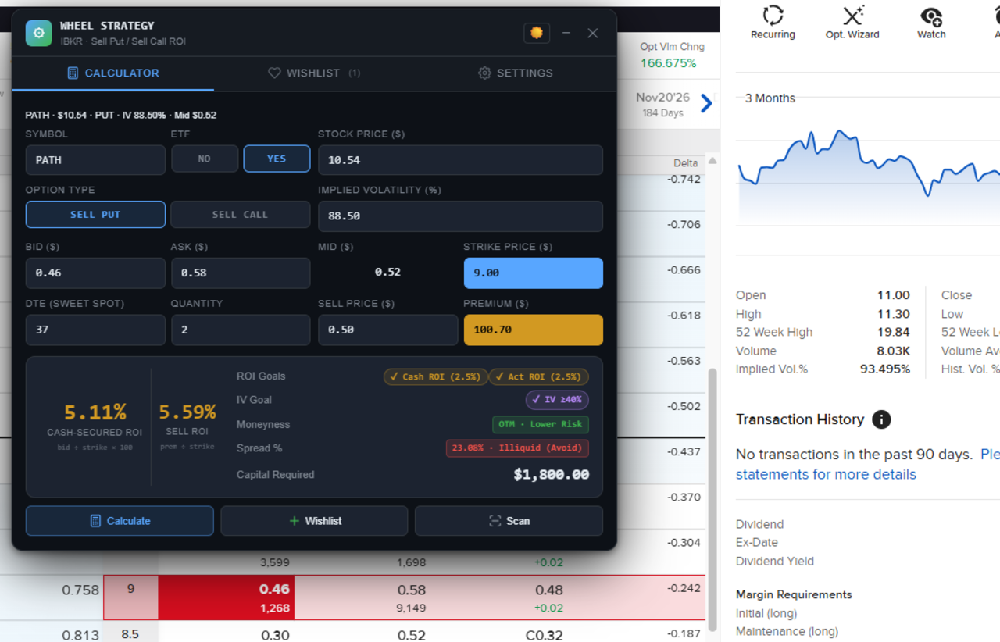

# Option Wheel Strategy ROI Calculator — Chrome Extension

**Stop calculating option ROI on spreadsheets.**

The Wheel Strategy ROI Calculator lives right on your IBKR option chain page. Click the icon, and it autofill bid, ask,
strike price, IV, and DTE from the page. You get instant ROI calculations, spread liquidity warnings, and moneyness
indicators — all in one compact overlay.

## Preview



---

## What It Does

- Calculates **Cash-secured ROI (Put)** and **Covered ROI (Call)** in real-time
- Shows **mid-price** and **bid-ask spread %** with liquidity rating (Very Liquid → Illiquid/Avoid)
- Displays **moneyness** (OTM/ATM/ITM) with risk level
- Syncs **Sell Price** and **Premium** automatically
- Saves entries to a **Wishlist** with ROI/IV goal highlighting
- Tracks **total capital**, **total premium**, and **portfolio ROI** across selected entries
- Exports your Wishlist to **CSV**
- **Resizable** — drag to enlarge the window for better readability
- **Compact Mode** — minimize to a floating ROI display

**Privacy-first:** 100% local. No data leaves your machine. No accounts, no tracking, no servers.

**Works on:** Chrome, Edge, Brave, Opera, and all Chromium browsers.

---

## Features

| Feature              | Detail                                                                  |
|----------------------|-------------------------------------------------------------------------|
| **Auto-scan**        | Detects bid/ask/strike/symbol/IV/DTE from IBKR pages                    |
| **Vector UI**        | High-fidelity vector icons for tabs, status banners, and action buttons |
| **Price & Premium**  | Split input for **Sell Price ($)** vs. **Premium ($)** (Auto-synced)    |
| **ROI Calculations** | Cash-secured ROI (PUT), Covered ROI (CALL) & Sell ROI                   |
| **Mid Price**        | Auto-calculated from Bid and Ask prices                                 |
| **Spread %**         | Liquidity indicator: Very Liquid / Okay / Careful / Illiquid            |
| **DTE Hints**        | Fast income (7-14d), Sweet spot (30-45d), More premium (60d+)           |
| **ROI Goal**         | Default 2.5% — customisable in Settings                                 |
| **Wishlist**         | Add symbols with full option details including Mid Price                |
| **Compact Mode**     | Collapse UI to focus on ROI results while maintaining status info       |
| **Highlight**        | Green highlight for symbols meeting ROI goal                            |
| **Moneyness**        | Displays OTM, ATM, ITM status and trade Risk Level                      |
| **Export**           | Download Wishlist as CSV with customisable filenames                    |
| **Resizable**        | Drag right edge to enlarge/shrink — persisted across sessions           |
| **Persistent**       | Settings & Wishlist saved via `chrome.storage.local`                    |
| **Icon-triggered**   | Extension only shows when user clicks the toolbar icon                  |

---

## Formulas

```
Cash-secured ROI % (PUT)  = (Bid Price ÷ Strike Price) × 100
Covered ROI % (CALL)      = (Bid Price ÷ Stock Price) × 100
Sell ROI % (PUT)          = Premium ÷ (Strike × Qty)
Sell ROI % (CALL)         = Premium ÷ (Stock Price × Qty)
Capital Required          = Strike Price × 100 × Qty
Mid Price                 = (Bid + Ask) ÷ 2
Spread %                  = (Ask - Bid) ÷ Mid Price × 100
```

### Price & Premium Sync
The calculator automatically syncs the per-share price and total dollar amount:

* **Premium** = Sell Price × 100 × Qty
* **Sell Price** = Premium ÷ (100 × Qty)

### Spread % Liquidity Guide

| Spread % | Meaning              |
|----------|----------------------|
| < 5%     | Very Liquid (good)   |
| 5–10%    | Okay                 |
| 10–20%   | Tradable but Careful |
| > 20%    | Illiquid / Avoid     |

### Moneyness Logic
| Scenario      | OTM (Lower Risk) | ATM (High Risk)   | ITM (Very High Risk) |
|---------------|------------------|-------------------|----------------------|
| **Sell Put**  | Strike < Stock   | Difference ≤ 0.5% | Strike > Stock       |
| **Sell Call** | Strike > Stock   | Difference ≤ 0.5% | Strike < Stock       |

**ATM Calculation:**
`ATM Difference % = |Strike Price - Stock Price| ÷ Stock Price × 100`

---

## Installation (Supported Browsers)

This extension works out-of-the-box on **Chrome, Microsoft Edge, Brave, Opera**, and other Chromium-based browsers.

*(Note: Safari is not directly supported without an Xcode macOS app wrapper).*

1. Open your browser's extensions page:
   - Chrome: `chrome://extensions/`
   - Edge: `edge://extensions/`
   - Brave: `brave://extensions/`
2. Enable **Developer Mode** (usually a toggle in the top-right or bottom-left)
3. Click **Load unpacked**
4. Select the `option-wheel-roi-cal/` folder
5. The extension icon will appear in your toolbar
6. **Click the icon** to open the calculator overlay on any page

---

## Supported Broker Pages (Auto-Scan)

- **Interactive Brokers (IBKR)** — interactivebrokers.com

---

## Usage

1. **Navigate** to an option chain on a supported broker
2. **Click** the extension icon — fields autofill from the page
3. **Adjust** bid, ask, strike, premium, quantity as needed
4. **Calculate** — ROI, Mid-Price, Spread %, and breakdown display instantly
5. **Add to Wishlist** — saves symbol with all details
6. **Wishlist tab** — rows with ROI ≥ goal are highlighted; select rows to see total capital, premium & ROI
7. **Export CSV** — downloads your full Wishlist
8. **Compact Mode** — Click the "−" button to minimize the UI
9. **Resize** — Drag the right edge to make the window larger or smaller

---

## Settings

| Setting           | Default         | Description                                          |
|-------------------|-----------------|------------------------------------------------------|
| Capital ($)       | 10000           | Budget — warn if total capital required exceeds this |
| ROI Goal          | 2.5%            | Highlight rows with Cash-secured/Covered ROI ≥ this  |
| IV Goal           | 40%             | Highlight rows with IV ≥ this                        |
| Auto-scan on Open | On              | Scan active tab when popup opens                     |
| Download Filename | option_wishlist | Custom base name for CSV exports                     |

---

## Privacy

**Privacy Policy — Wheel Strategy ROI Calculator**

This extension operates **100% locally**. It does not collect, transmit, or store any personal data on external servers.

All data (settings, wishlist entries, calculator values) is stored locally on your device using Chrome's
`chrome.storage.local` API and never leaves your machine.

- No analytics or tracking
- No user accounts
- No network requests
- No third-party services
- No data collection of any kind

Contact: vzangloo@7mayday.com

---

## Support & Feedback

If you encounter any bugs with the IBKR data detection or have feature requests, please reach out to: **V. Zang, Loo** (vzangloo@7mayday.com).

---

## Recent Updates (v5.2)

- **Icon-triggered only**: Extension no longer auto-injects on every page. Only shows when the user clicks the toolbar
  icon.
- **Gold coin icon**: New 3D gold coin extension icon.
- **Ask Price**: Replaced "Total Bid Asking" with Ask Price using correct IBKR selectors.
- **Mid-Price**: Auto-calculated `(Bid + Ask) / 2` displayed in the calculator.
- **Spread % Indicator**: Liquidity assessment based on bid-ask spread (Very Liquid / Okay / Careful / Illiquid).
- **2 Decimal Precision**: Bid, Ask, Strike, Sell Price, Premium, and IV all display to two decimal places.
- **Renamed fields**: "Actual Price" → "Sell Price," "Actual ROI" → "Sell ROI."
- **Wishlist Mid-column**: Mid-Price now saved and displayed in the Wishlist table.
- **Wishlist totals**: Total Capital, Total Premium, and ROI shown for selected entries.
- **Resizable window**: Drag right edge to enlarge — width persisted across sessions.
- **Delete confirmation**: Wishlist delete requires two clicks (like Clear All).
- **Reload resilience**: Extension properly recovers after the browser extension reloads.
- **Orphan cleanup**: Handles stale overlays from previous extension sessions gracefully.

---

## Permissions Justification

| Permission          | Justification                                                                                                                                                                                                                                         |
|---------------------|-------------------------------------------------------------------------------------------------------------------------------------------------------------------------------------------------------------------------------------------------------|
| `storage`           | Used to persist user settings (ROI goal, IV goal, capital budget), calculator input values, and the Wishlist data locally on the user's device. No data is sent externally.                                                                           |
| `activeTab`         | Required to read option chain data (bid, ask, strike, IV, DTE) from the currently active broker page (Interactive Brokers) when the user clicks the extension icon. Only accesses the tab the user is actively viewing.                               |
| `scripting`         | Used to inject the calculator overlay (content script and CSS) into the active tab when the user clicks the extension icon. The extension does not auto-inject on page load — injection only occurs on explicit user action.                          |
| `<all_urls>` (host) | Allows the calculator overlay to be injected on any page where the user clicks the icon. Auto-scan of option data only works on Interactive Brokers (interactivebrokers.com), but the calculator UI can be used manually on any page for convenience. |

**Remote code:** This extension does not use any remote code. All JavaScript and CSS are bundled locally in the
extension package. No external scripts, no `eval()`, no remote modules.
