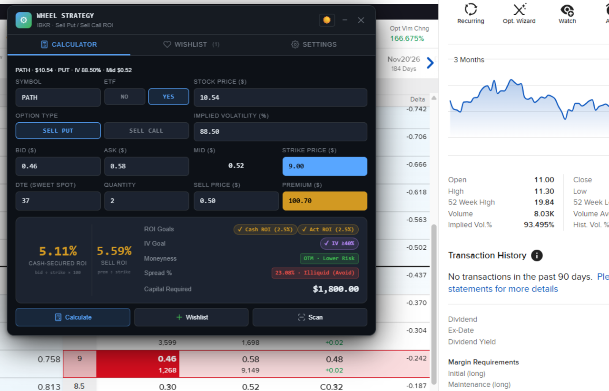

# Option Wheel Strategy ROI Calculator — Chrome Extension

**Stop calculating option ROI on spreadsheets.**

The Wheel Strategy ROI Calculator lives right on your IBKR option chain page. Click the icon, and it autofill bid, ask,
strike price, IV, and DTE from the page. You get instant ROI calculations, spread liquidity warnings, and moneyness
indicators — all in one compact overlay.

## Preview



---

## What It Does

- Calculates **Cash-secured ROI (Put)** and **Covered ROI (Call)** in real-time
- Shows **mid-price** and **bid-ask spread %** with liquidity rating (Very Liquid → Illiquid/Avoid)
- Displays **moneyness** (OTM/ATM/ITM) with risk level
- Syncs **Sell Price** and **Premium** automatically
- Saves entries to a **Wishlist** with ROI/IV goal highlighting
- Tracks **cash required**, **total premium**, and **ROI** across selected entries
- Exports your Wishlist to **CSV**
- **Compact Mode** — minimize to a floating ROI display

**Privacy-first:** 100% local. No data leaves your machine. No accounts, no tracking, no servers.

**Works on:** Chrome, Edge, Brave, Opera, and all Chromium browsers.

---

## Features

| Feature              | Detail                                                                                     |
|----------------------|--------------------------------------------------------------------------------------------|
| **Auto-scan**        | Detects bid/ask/strike/symbol/IV/DTE from IBKR pages                                       |
| **Cost Basis**       | Sell Call reads assigned shares from the IBKR Trades table — ROI on cost, If Called return |
| **Asset Type**       | Manual dropdown: Equity, ETF, REIT, ADR, CEF, Index, BDC — remembered per symbol           |
| **Vector UI**        | High-fidelity vector icons for tabs, status banners, and action buttons                    |
| **Price & Premium**  | Split input for **Sell Price ($)** vs. **Premium ($)** (Auto-synced)                       |
| **ROI Calculations** | Cash-secured ROI (PUT), Covered ROI (CALL) & ROC (Return on Capital)                      |
| **Mid Price**        | Auto-calculated from Bid and Ask prices                                                    |
| **Spread %**         | Very Liquid (< 5%) / Okay (< 10%) / Tradable – Careful (< 20%) / Illiquid – Avoid (≥ 20%)  |
| **DTE Hints**        | Fast income (7-14d), Sweet spot (30-45d), More premium (60d+)                              |
| **ROI Goal**         | Default 2.5% — checks Cash-secured / Covered ROI only (not ROC); customisable in Settings  |
| **IV Goal**          | Badge beside Implied Volatility: purple ✓ when met, red ✗ when below; customisable        |
| **Wishlist**         | Add symbols with full option details including Mid Price and Cost Basis                    |
| **Wishlist Totals**  | Cash Required (Sell Puts), actual Premium, and ROI for ticked rows                         |
| **Compact Mode**     | Collapse UI to focus on ROI results while maintaining status info                          |
| **Highlight**        | Wishlist rows: gold = ROI & IV goals met, green = ROI goal only, purple = IV goal only     |
| **Moneyness**        | Displays OTM, ATM, ITM status and trade Risk Level                                         |
| **Export**           | Download Wishlist as CSV with customisable filenames                                       |
| **Persistent**       | Settings & Wishlist saved via `chrome.storage.local`                                       |
| **Icon-triggered**   | Extension only shows when user clicks the toolbar icon                                     |

---

## Formulas

```
Period                    = ceil(DTE / 30) × 30
Cash-secured ROI % (PUT)  = (Bid ÷ Strike ÷ DTE × Period) × 100
Covered ROI % (CALL)      = (Bid ÷ Cost Basis ÷ DTE × Period) × 100   (Stock Price if no cost basis)
ROC % (PUT)               = Premium ÷ (Strike × Qty)                  (cash secured)
ROC % (CALL)              = Premium ÷ (Cost Basis × Qty)              (stock capital; Stock Price if no cost basis)
Cost Basis (CALL)         = Σ Buy Amount ÷ Shares held (average cost)
If Called (CALL)          = (Call Px + Strike − Cost Basis) × 100 × Qty
Call Px (CALL)            = Premium ÷ (100 × Qty) if premium entered/detected, otherwise Bid
Capital Required (PUT)    = Strike Price × 100 × Qty
Capital Held (CALL)       = Cost Basis × 100 × Qty                    (Strike if no cost basis)
Mid Price                 = (Bid + Ask) ÷ 2
Spread %                  = (Ask - Bid) ÷ Mid Price × 100
```

> Cash-secured / Covered ROI is a quick check at the current bid, scaled to the 30-day bucket containing the DTE
> (1–30 → 30, 31–60 → 60, …). ROC (Return on Capital) is the actual return on the premium you enter, for this trade
> only — shown in the results panel and beside Premium in the input grid.

### Wishlist Totals (ticked rows)

```
Cash Required = Σ Capital Required of ticked Sell Puts   (Sell Calls excluded — shares already owned)
Premium       = Σ Premium ($) entered on ticked rows     (actual premium only, no estimate)
ROI %         = Premium ÷ Cash Required × 100
```

- Rows saved without a premium count as $0 and are flagged: "(N rows without premium)"
- Budget warning shows when Cash Required > Capital ($) in Settings

### Cost Basis Detection (Sell Call)

On the ticker's page, the extension reads the IBKR Trades table (`Date`, `Transaction Type`, `Quantity`, `Price`,
`Amount`) to find shares from assigned puts.

| Transaction Type | Handling                                                   |
|------------------|------------------------------------------------------------|
| `Buy`            | Adds shares; cost = \|Amount\| (falls back to Qty × Price) |
| `Sell`           | Removes shares at average cost                             |
| Other            | Skipped; listed in the Cost Basis tooltip                  |

- Rows are processed oldest → newest
- No open shares → Covered ROI falls back to Stock Price
- Cost Basis shows above Covered ROI; ⚠ red when Strike < Cost Basis (loss if called) or shares held < Qty × 100
- Cost Basis excludes premium earned from the original put (not available on the ticker's page)

### Below-Cost Call Advice

Shown when Strike < Cost Basis:

```
Share loss          = (Strike − Cost) × 100 × Qty
Premium             = Call Px × 100 × Qty
Net if called       = Share loss + Premium
Breakeven strike    = Cost − Call Px
Calls to offset gap = ceil((Cost − Strike) ÷ Call Px)   (assumes same premium each cycle)
```

### Price & Premium Sync
The calculator automatically syncs the per-share price and total dollar amount:

* **Premium** = Sell Price × 100 × Qty
* **Sell Price** = Premium ÷ (100 × Qty)

---

## Installation (Supported Browsers)

This extension works out-of-the-box on **Chrome, Microsoft Edge, Brave, Opera**, and other Chromium-based browsers.

*(Note: Safari is not directly supported without an Xcode macOS app wrapper).*

1. Open your browser's extensions page:
   - Chrome: `chrome://extensions/`
   - Edge: `edge://extensions/`
   - Brave: `brave://extensions/`
2. Enable **Developer Mode** (usually a toggle in the top-right or bottom-left)
3. Click **Load unpacked**
4. Select the `option-wheel-roi-cal/` folder
5. The extension icon will appear in your toolbar
6. **Click the icon** to open the calculator overlay on any page

---

## Supported Broker Pages (Auto-Scan)

- **Interactive Brokers (IBKR)** — interactivebrokers.com

---

## Usage

1. **Navigate** to an option chain on a supported broker
2. **Click** the extension icon — fields autofill from the page
3. **Adjust** bid, ask, strike, premium, quantity as needed
4. **Calculate** — ROI, Mid-Price, Spread %, and breakdown display instantly
5. **Add to Wishlist** — saves symbol with all details
6. **Wishlist tab** — rows meeting ROI/IV goals are highlighted; tick rows to see Cash Required, Premium & ROI
7. **Export CSV** — downloads your full Wishlist
8. **Compact Mode** — Click the "−" button to minimize the UI

---

## Settings

| Setting           | Default         | Description                                             |
|-------------------|-----------------|---------------------------------------------------------|
| Capital ($)       | 10000           | Budget — warn if Wishlist Cash Required exceeds this    |
| ROI Goal          | 2.5%            | Highlight rows with Cash-secured/Covered ROI ≥ this     |
| IV Goal           | 40%             | Highlight rows with IV ≥ this                           |
| Auto-scan         | On              | Auto-detect IBKR data. Disable to use Scan button only. |
| Download Filename | option_wishlist | Custom base name for CSV exports                        |

---

## Privacy

**Privacy Policy — Wheel Strategy ROI Calculator**

This extension operates **100% locally**. It does not collect, transmit, or store any personal data on external servers.

All data (settings, wishlist entries, calculator values) is stored locally on your device using Chrome's
`chrome.storage.local` API and never leaves your machine.

- No analytics or tracking
- No user accounts
- No network requests
- No third-party services
- No data collection of any kind

Contact: vzangloo@7mayday.com

---

## Support & Feedback

If you encounter any bugs with the IBKR data detection or have feature requests, please reach out to: **V. Zang, Loo** (vzangloo@7mayday.com).

---

## Recent Updates (v5.1.7)

- **Cost basis for Sell Call**: Detects assigned shares from the IBKR Trades table (Buy/Sell, average-cost method);
  Covered ROI, ROC, and Capital Held now use cost basis.
- **If Called**: Shows total return ($ and %) if shares are called away at the strike.
- **Below-cost call advice**: When strike < cost, shows share loss, premium offset, net, breakeven strike, and calls
  needed to offset the gap.
- **Cost Basis warning**: Shown above Covered ROI with ⚠ when the strike is below cost (loss if called) or shares don't
  cover the contract quantity.
- **Wishlist & CSV**: New Cost$ column and `Cost Basis ($)` export field.
- **Wishlist ROI aligned**: ROI, ROC, and Capital are recalculated for every row with the calculator's formula (
  period-normalized, cost basis for calls); older entries are updated automatically.
- **Renamed**: "Sell ROI" → "ROC" (Return on Capital) — results panel, Wishlist column, CSV column `ROC (%)`.
- **ROC not goal-checked**: ROI Goals shows only Cash-secured / Covered ROI; ROC has no goal chip or goal colouring.
- **ROC in input grid**: Display-only "ROC" beside Premium (hover: "Return on Capital"); mirrors the results-panel ROC.
- **Layout**: DTE moved beside Stock Price; IV Goal moved beside Implied Volatility (still shown in compact mode);
  results panel split into two columns aligned with the input grid.
- **IV Goal warning**: Badge turns red (✗ IV < goal) when IV is below the IV Goal; purple (✓) when met.
- **If Called & below-cost advice**: Use the entered/detected premium per share; fall back to Bid only when none.
- **Wishlist totals**: "Capital" renamed to "Cash Required"; Premium total uses actual premium only and flags ticked
  rows without one.

---

## Previous Updates (v5.1.6)

- **Period-normalized ROI**: ROI is now normalized to the nearest 30-day period (`ceil(DTE/30) × 30`) for
  apples-to-apples comparison across different expirations.
- **Asset type selector**: Replaced binary ETF Yes/No toggle with a dropdown supporting Equity, ETF, REIT, ADR, CEF,
  Index, and BDC.
- **Per-symbol memory**: Manually selected asset types are remembered per symbol and restored on re-scan.
- **Capital excludes calls**: Wishlist capital total no longer includes Sell Call entries (covered calls don't require
  additional capital).
- **Extension icon in header**: Header logo uses the extension icon directly instead of the styled "$" badge.

---

## Previous Updates (v5.1.4)

- **Icon-triggered only**: Extension no longer auto-injects on every page. Only shows when the user clicks the toolbar
  icon.
- **Gold coin icon**: New 3D gold coin extension icon.
- **Ask Price**: Replaced "Total Bid Asking" with Ask Price using correct IBKR selectors.
- **Mid Price**: Auto-calculated `(Bid + Ask) / 2` displayed in the calculator and compact mode banner.
- **Spread % Indicator**: Liquidity assessment based on bid-ask spread (Very Liquid / Okay / Careful / Illiquid).
- **2 Decimal Precision**: Bid, Ask, Strike, Sell Price, Premium, and IV all display to 2 decimal places.
- **Renamed fields**: "Actual Price" → "Sell Price", "Actual ROI" → "Sell ROI".
- **Capital Held**: Sell Call now shows "Capital Held" instead of "Capital Required".
- **Wishlist Mid column**: Mid Price now saved and displayed in the Wishlist table.
- **Wishlist totals**: Total Capital, Total Premium, and ROI shown for selected entries.
- **Resizable window**: Drag right edge to enlarge — width persisted across sessions.
- **Delete confirmation**: Wishlist delete requires two clicks (like Clear All).
- **Auto-scan toggle**: When disabled, all automatic detection stops — use Scan button only.
- **Performance**: Debounced storage writes, throttled pollers, self-mutation filtering to prevent browser hangs.
- **Reload resilience**: Extension properly recovers after browser extension reload.
- **Compact mode**: Banner shows Bid, Ask, and Mid prices for quick reference.

---

## Permissions Justification

| Permission                | Justification                                                                                                                                                                                                                |
|---------------------------|------------------------------------------------------------------------------------------------------------------------------------------------------------------------------------------------------------------------------|
| `storage`                 | Used to persist user settings (ROI goal, IV goal, capital budget), calculator input values, and the Wishlist data locally on the user's device. No data is sent externally.                                                  |
| `activeTab`               | Required to inject the calculator overlay and read option chain data (bid, ask, strike, IV, DTE) from the currently active tab when the user clicks the extension icon. Only accesses the tab the user is actively viewing.  |
| `scripting`               | Used to inject the calculator overlay (content script and CSS) into the active tab when the user clicks the extension icon. The extension does not auto-inject on page load — injection only occurs on explicit user action. |
| `host_permissions` (IBKR) | Limited to `*.interactivebrokers.com` and `*.interactivebrokers.com.au` — the only broker pages where auto-scan reads option chain data. No broad host access is requested.                                                  |

**Remote code:** This extension does not use any remote code. All JavaScript and CSS are bundled locally in the
extension package. No external scripts, no `eval()`, no remote modules.

---

## License

This project is licensed under the [MIT License](LICENSE).
